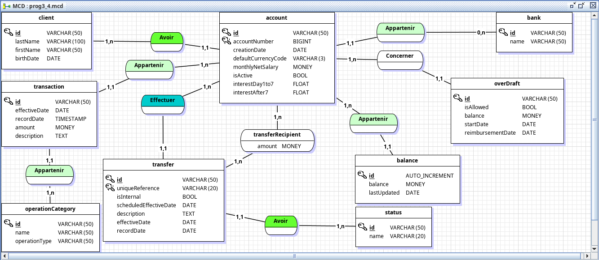
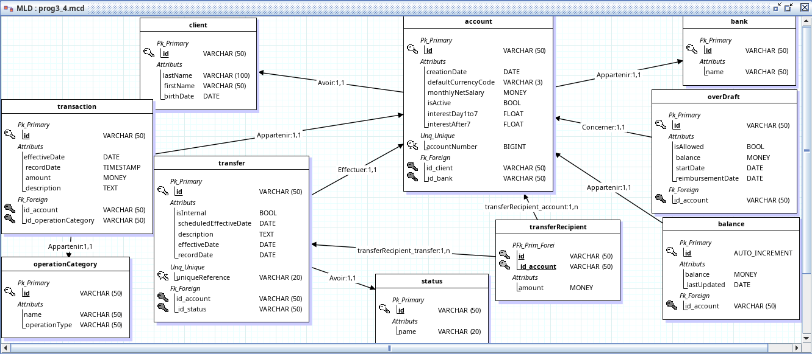

# Dompet API

## Description
This API provides functionalities for managing a virtual wallet.

## Configurations
Set your environment variables as such:
```
DB_URL=jdbc:postgresql://{HOST}:{PORT}/{DATABASE_NAME}
DB_USER={USERNAME}
DB_PASSWORD={PASSWORD}
```

**Make sure the database exists first**

## Technologies used
- Java
  - Spring Boot Web: Used for exposing the endpoints.
  - Flyway Core: For database schema migration.
  - Lombok: Library to reduce boilerplate code in Java classes.
  - Java Reflect
- PostgreSQL

## OAS Preview
[View OpenAPI Specification](https://petstore.swagger.io/?url=https://raw.githubusercontent.com/Dompet-hei/Dompet-back/main/docs/openapi.yml)

## Postman Collection
[](https://app.getpostman.com/run-collection/28674538-d6c7f822-1019-40c2-b9a1-6640052e5932?action=collection%2Ffork&source=rip_markdown&collection-url=entityId%3D28674538-d6c7f822-1019-40c2-b9a1-6640052e5932%26entityType%3Dcollection%26workspaceId%3Da73e7eb5-b4a9-44e8-9c23-761dc57f26fb)

## Database Structure

---

   
## Contributors
- STD22079
- STD22075
- STD21089
